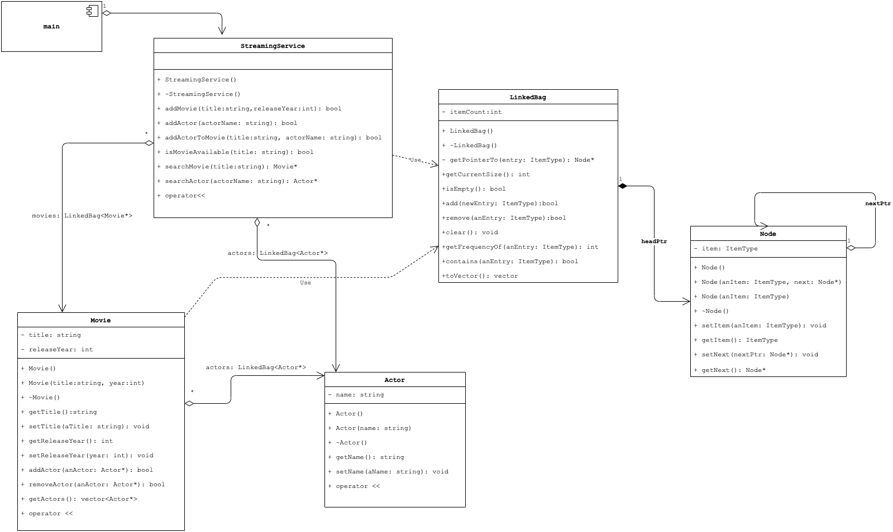

# Laboratory #2

-----
**CSCI2421 - Summer 2021**

### **_Team Members Names:_**
- Student #1: `Kai Marshall`
- Student #2: `Matthew Starkey`
- Student #3: `complete here`

### **Lab Status**
```text
Describe **briefly** how complete your lab is, and how did you tested it.
Does it work on CSEGrid?
```

### **Discussion**
_What benefits had for this lab development that all the interfaces of the class were well-defined?_ 
```text
Discuss your ideas with your partner an write a short summary here.
```

-----

## TODO:
1. Complete your and your teammates' names on the top of this document.
1. Open the **TODO tab** on CLION, and complete the implementation.
1. **Document your code**, as described on Canvas.
1. All team members should be working concurrently using **code-with-me on Clion**.
1. If you have questions, use Zoom _"Ask for help button"_ on the toolbar (bottom), and the instructors will get to
   your room asap. You can also use Slack concurrently.
1. **Please keep your camera turned on, so you can interact with your team.**
1. Instructors will be walking through the rooms regularly.
1. Push your solution to GitHub
1. Pull your solution from git into CSEGrid
1. Compile it and run it on CSEGrid using `make`.
1. **Capture a screenshot and save it on your CLion Project folder.**
1. Complete the *Lab Status* section on this document.
1. Complete Discussion.

### HINTS:
- each cpp file has some hints.
- however, the most importan one, **use stubs**!

### Submission
- Complete the lab.
- On CLion execute Build --> Clean from the menu (this will remove all temporary files)
- Using zip, compress the entire CLion Project and upload it to canvas before 11:59am.
   - **No submission will be accepted outside from Canvas.**

## Domain Description
We will continue working on the Streaming Service topic we developed in _Lab #1_.
We will be implementing the following ADT:
- `Movie`: movies that can be played back through the streaming service.
- `Actor`: actors that participated in movies. 
- `StreamingService`: the service represents the system (program) that will host movies.
- `LinkedBag`: the linked bag as described in our lectures.

Our application will be a console application implemented in our `main.cpp`.

We will use dynamically allocated memory for objects (`actors`, `movies`), however, the `StreamingServive` will be the only place where memory should be allocated/deallocated.

The following UML Class Diagram represents the ADTs we will be implementing.



### `StreamingService`
- This object will have two linked bags, one to store movies (pointers) -`movies`- and one to store the actors (pointers) -`actors`.
- **Methods**:
    - `addMovie`: that takes the movie information and creates a new movie using the information received. By default, the movie will have no actors associated with it.
    - `addActor`: receives the actor information, and if it doesn't exist, it will be created. If the actor exists, the method returns `false`.
    - `addActorToMovie`: receives the movie title and actor name. Searches for the actor and movie. If either the movie or actor is not in the system it returns false. Otherwise, it adds the actor to the movie. 
    - `isMovieAvailable`: returns whether a movie with that title is in the system.
    - `searchMovie`: returns the movie (pointer) that matches the title. If the movie is not in the database, returns `nullptr`.  
    - `searchActor`: searches for the actor and returns it if the actor in the database, returns `nullptr`.
    - The output `operator<<`: outputs all the movies and its actors as shown below and should rely on the `Movie::operator<<`:
      This is the output when you execute `cout<< aStreamingServiceObj;`
        ```text
        Movies in the Streaming Service: 
        >>Harry Potter and the Philosopher's Stone--2001<<
            - Daniel Radcliffe
            - Emma Watson
            - Rupert Grint
        >>Harry Potter and the Chamber of Secrets--2002<<
            - Daniel Radcliffe
            - Emma Watson
            - Rupert Grint
        >>Harry Potter and the Prisoner of Azkaban--2004<<
            - Daniel Radcliffe
            - Emma Watson
            - Rupert Grint
            - Bonnie Wright
        >>Harry Potter and the Goblet of Fire--2005<<
            - Daniel Radcliffe
            - Emma Watson
            - Rupert Grint
            - Alan Rickman
        >>Harry Potter and the Order of the Phoenix--2007<<
            - Daniel Radcliffe
            - Emma Watson
            - Rupert Grint
        --------------------------------------------
        ```
### `Movie`
- A movie has a `title` and `releaseYear` and a list `actors` (`LinkedBag<Actor*>`) of actors.
- The movie object will never create actors, those are always sent by argument and are stored in the StreamingService, as the same actors may participate in several movies.
- In addition to the **getters and setters** for `title` and `releaseYear` there are two methods to handle actor:
    - `addActor`: that adds the actor to the actor lists, if not there.
    - `removeActor`: that removes the actor if it's in the actor's bag.
    - `getActors`: that returns a `vector` of actors (pointers). 
- The output `operator<<`: outputs all the movie's data as shown below and should rely on the `Actor::operator<<`:
  This is the output when you execute `cout<< aMovie;`
  ```text
  >>Harry Potter and the Philosopher's Stone--2001<<
  - Daniel Radcliffe
  - Emma Watson
  - Rupert Grint
  ```
### `Actor`
- The actor has for now just his/her `name`.
- The output `operator<<`: outputs the actor/actress name as follows:
  This is the output when you execute `cout<< anActor;`
  ```text
        - Daniel Radcliffe
  ```

## Main Program
The main program loads the predefined data (the one shown see [StreamingService](###streamingservice) `operand<<` above) and displays a menu as it opens with 4 options:
1. Display the movies in the streaming service.
   - Will just print the StreamingService object.
1. Check movie availability
   - asks the user for a movie title and if the movie is in the system it will print it out
   - otherwise, will tell the user that the movie is not there.
1. Add new movie to the system
   - Will ask for the movie title and release year.
   - Will add the movie to the Streaming Service.
1. Add Actor
   - Ask for the actor name and add it to the streaming service.
1. Add Actor to movie
   - Asks for actor name and movie title and adds the actor to the movie through the streaming service
1. Search Movie
   - Asks for the movie title
   - Displays the movie on screen. 
1. Exit the application.

The application will continue showing the menu after the user executes some action until he/she selects
"exit the application" option.
